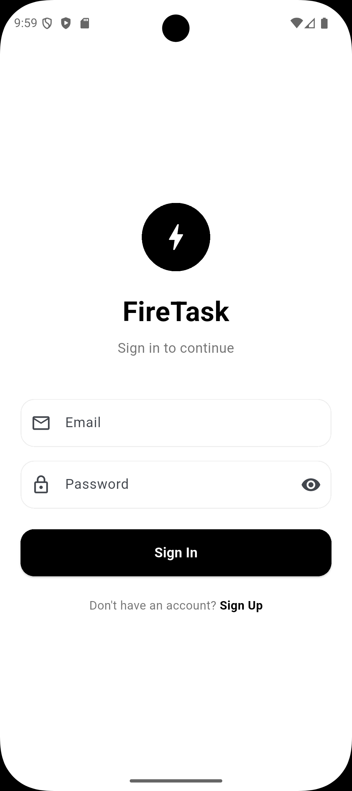
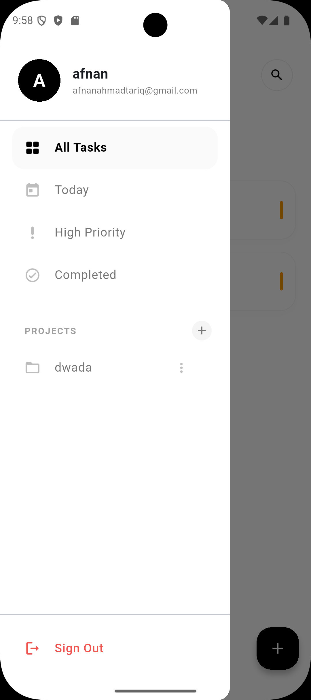
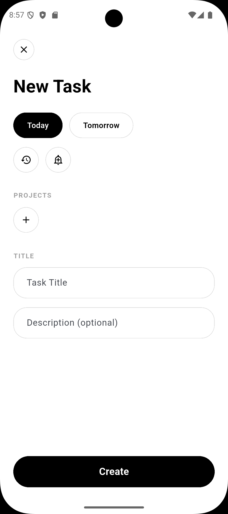
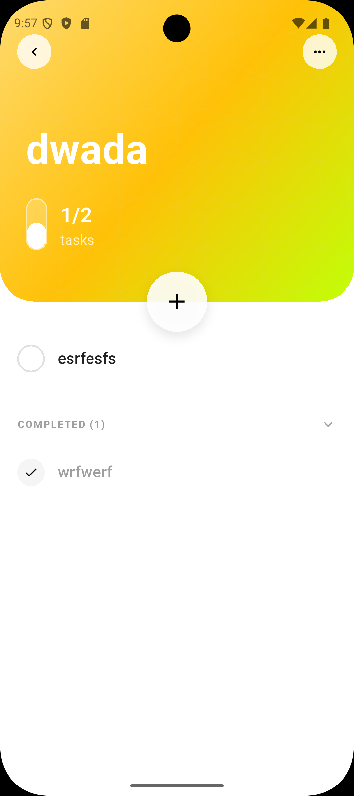
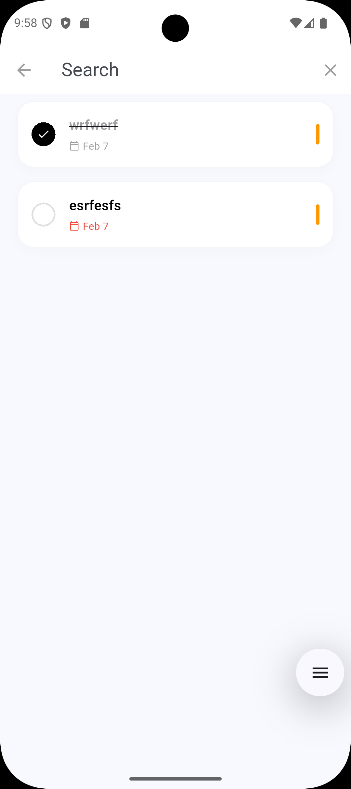

# 🔥 FireTask - Modern To-Do App

A beautiful, feature-rich task management app built with Flutter and Firebase. Organize your life with projects, tags, and smart views.

<p align="center">
  
  
  
  
</p>

## ✨ Features

### 🔐 Authentication

- **Email/Password Login** - Secure Firebase Authentication
- **User Registration** - Create new accounts with name, email, password
- **Password Reset** - Forgot password functionality
- **User-specific Data** - Each user sees only their own tasks and projects

### 📋 Task Management

- **Create Tasks** - Add title, description, due date, priority
- **Quick Actions** - Mark complete, edit, delete with swipe gestures
- **Optimistic Updates** - Instant UI feedback, syncs in background
- **Pull to Refresh** - Sync latest data from Firebase

### 📁 Project Organization

- **Create Projects** - Group related tasks together
- **Project Colors** - Customize each project with vibrant colors
- **Project Details** - View progress, pending/completed tasks
- **Rename/Delete** - Full project management

### 🏷️ Smart Views

- **All Tasks** - See everything at a glance
- **Today** - Tasks due today
- **High Priority** - Focus on what matters
- **Completed** - Review finished tasks

### 🎨 Beautiful Design

- **Modern UI** - Clean, minimalist interface
- **Dynamic Gradients** - Project headers with custom colors
- **Smooth Animations** - Polished user experience
- **Dark/Light Theme** - Material 3 theming

## 📱 Screenshots

### Authentication & Navigation

|                     Login                      |                   Drawer Menu                   |                     Search                      |
| :--------------------------------------------: | :---------------------------------------------: | :---------------------------------------------: |
|  |  |  |

### Task Management

|                   Add New Task                    |                      Project View                      |
| :-----------------------------------------------: | :----------------------------------------------------: |
|  |  |

## 🚀 Getting Started

### Prerequisites

- Flutter SDK (version 3.0+)
- Dart SDK
- Firebase account

### Installation

1. **Clone the repository**

   ```bash
   git clone https://github.com/afnanahmadtariq/to-do-app.git
   cd to-do-app
   ```

2. **Install dependencies**

   ```bash
   flutter pub get
   ```

3. **Firebase Setup**
   - Create a project at [Firebase Console](https://console.firebase.google.com/)
   - Enable **Authentication** (Email/Password)
   - Enable **Cloud Firestore**
   - Add your app (Android/iOS/Web)
   - Download `google-services.json` (Android) or `GoogleService-Info.plist` (iOS)
   - Update `lib/firebase_options.dart`

4. **Deploy Firestore Rules & Indexes**

   ```bash
   firebase use <your-project-id>
   firebase deploy --only firestore
   ```

5. **Run the app**
   ```bash
   flutter run
   ```

## 📱 Download

Get the latest Android build:

[](https://github.com/afnanahmadtariq/to-do-app/releases/latest/download/app-release.apk)

> **Note**: Always points to the most recent release.

## 🛠️ Tech Stack

| Technology          | Purpose                     |
| ------------------- | --------------------------- |
| **Flutter**         | Cross-platform UI framework |
| **Firebase Auth**   | User authentication         |
| **Cloud Firestore** | Real-time database          |
| **Provider**        | State management            |
| **Material 3**      | Modern design system        |

## 📂 Project Structure

```
lib/
├── main.dart              # App entry point
├── firebase_options.dart  # Firebase configuration
├── models/
│   ├── task.dart          # Task model
│   ├── project.dart       # Project model
│   └── tag.dart           # Tag model
├── providers/
│   ├── task_provider.dart # Task state management
│   └── auth_provider.dart # Auth state management
├── screens/
│   ├── login_screen.dart
│   ├── register_screen.dart
│   ├── home_screen.dart
│   ├── add_task_screen.dart
│   └── project_detail_screen.dart
├── services/
│   ├── firebase_service.dart  # Firestore operations
│   └── auth_service.dart      # Auth operations
└── widgets/
    ├── task_tile.dart
    └── task_search_delegate.dart
```

## 🔒 Firestore Security Rules

Users can only access their own data:

```javascript
rules_version = '2';
service cloud.firestore {
  match /databases/{database}/documents {
    match /tasks/{taskId} {
      allow read, write, delete: if request.auth != null
        && request.auth.uid == resource.data.userId;
    }
    match /projects/{projectId} {
      allow read, write, delete: if request.auth != null
        && request.auth.uid == resource.data.userId;
    }
  }
}
```

## 🎨 Design Credits

- **Design Inspiration**: [UI/UX Design for Mobile Task Management App](https://dribbble.com/shots/21236436-UI-UX-Design-for-Mobile-Task-Management-App) on Dribbble

## 📄 License

This project is licensed under the MIT License - see the [LICENSE](LICENSE) file for details.

---

<p align="center">
  Made with ❤️ using Flutter & Firebase
</p>
